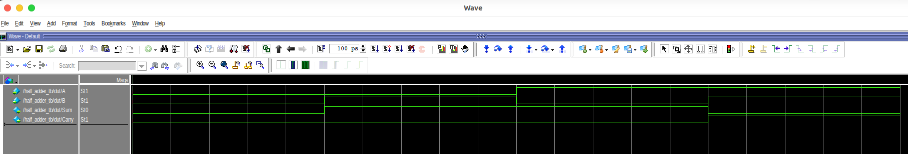
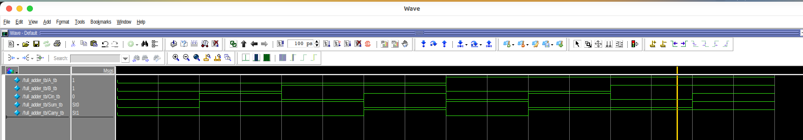
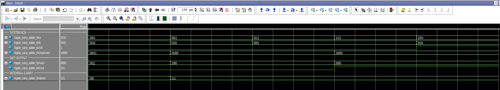
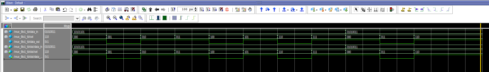
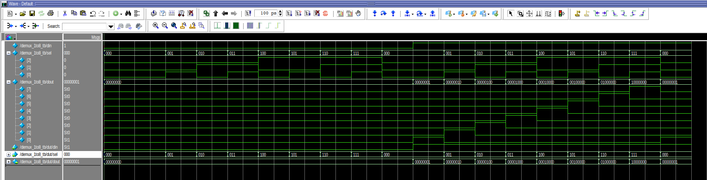
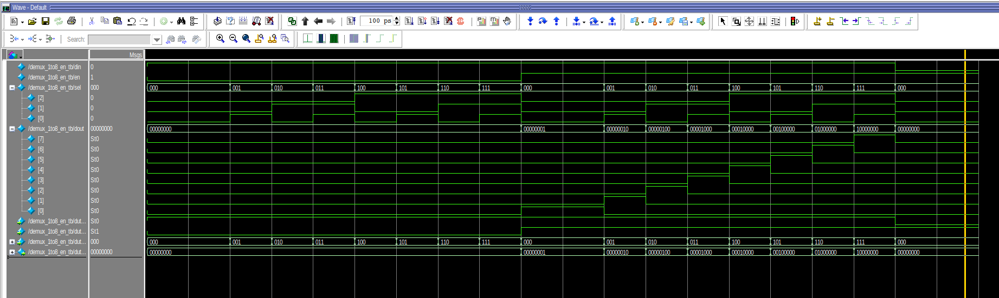
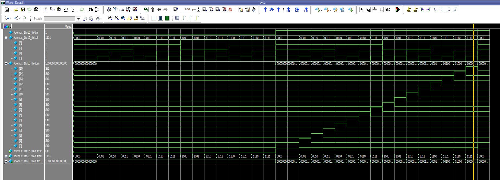

# Verilog Basic Designs
> **Simulation Tool**:  
> [Download ModelSim FPGA Standard Edition (v20.1.1)](https://www.altera.com/downloads/simulation-tools/modelsim-fpgas-standard-edition-software-version-20-1-1)


This repository contains my practice projects for **Verilog HDL and FPGA design**.
The focus is on implementing basic digital logic modules and verifying them
using **ModelSim** with an automated workflow.

---

##  Project Structure
The project follows a structured directory layout:

```text

├── rtl/          # Synthesizable SystemVerilog source code
├── tb/           # Testbench files
├── sim/          # Simulation directory (Makefile & Scripts)
├── docs/          # Documentation & Waveforms
└── README.md
```

---

## Implemented Modules

### 1. Half Adder

A basic combinational circuit that adds two 1-bit inputs.

- Inputs: `A`, `B`
- Outputs: `Sum`, `Carry`
- Logic:
  - `Sum   = A ^ B`
  - `Carry = A & B`

**Simulation**



### 2. Full Adder

An extension of the Half Adder that includes a carry-in input.

- Inputs: `A`, `B`, `Cin`
- Outputs: `Sum`, `Carry`
- Logic:
  - `Sum   = A ^ B ^ Cin`
  - `Carry = (A & B) | (Cin & (A ^ B))`

**Simulation**



### 3. Ripple Carry Adder

A 4-bit adder constructed by cascading four Full Adders in a chain, where the carry-out of each stage propagates to the next.

- Inputs: `A[3:0]`, `B[3:0]`, `Cin`
- Outputs: `Sum[3:0]`, `Cout`
- Logic:
  - `Sum[i] = A[i] ^ B[i] ^ C[i]`
  - `C[i+1] = (A[i] & B[i]) | (C[i] & (A[i] ^ B[i]))`

**Simulation**



### 4. Multiplexer 8-to-1

A combinational circuit that selects one of the 8 data input lines and forwards it to the single output line based on the 3-bit selection values.

- Inputs: `Data_In[7:0]`, `Sel[2:0]`
- Outputs: `Y`
- Logic:
  - `Y = Data_In[Sel]`

**Simulation**



### 5. Demultiplexer

A combinational circuit that routes a single input to one of multiple outputs
based on select signals.

#### - Demux 1-to-8
- Inputs: `Din`, `Sel[2:0]`
- Outputs: `Dout[7:0]`
- Logic:
  - Only one output bit is asserted based on `Sel`

**Simulation**



#### - Demux 1-to-8 with Enable
- Inputs: `Din`, `En`, `Sel[2:0]`
- Outputs: `Dout[7:0]`
- Behavior:
  - When `En = 0`, all outputs are forced to 0

**Simulation**



#### - Demux 1-to-16
- Inputs: `Din`, `Sel[3:0]`
- Outputs: `Dout[15:0]`

**Simulation**




---

##  How to Run (Simulation)

### Prerequisites
- ModelSim (Intel FPGA Standard Edition or Questa)
- GNU Make

### Run Simulation
```bash
cd sim
make wave-half_adder
make wave-full_adder
make wave-ripple_carry_adder
make wave-mux_8to1
make wave-.....
```


## Bonus: Future Updates

Additional Verilog modules and simulation examples will be added in future updates.


